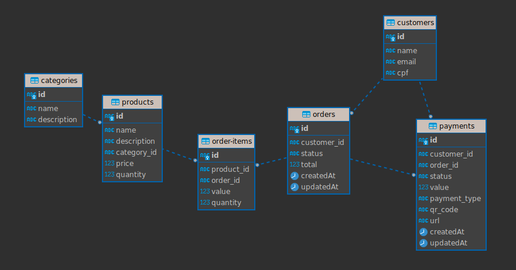

  

<h3>
    Google Cloud Platform + Infrastructure as Code
</h3>

 

&nbsp&nbsp&nbsp&nbsp&nbsp&nbsp&nbsp&nbsp&nbsp&nbsp&nbsp&nbsp&nbsp&nbsp&nbsp&nbsp&nbsp&nbsp&nbsp&nbsp&nbsp&nbsp&nbsp&nbsp&nbsp&nbsp&nbsp&nbsp&nbsp&nbsp

 

### This is a project to generate a Infrastructure in Google Cloud Platform. This works with many modules made with Terraform to set all configuration.

  

## Requirements

- Google Cloud Platform account
- Create a project
- Create a Service Account - and get the credentials JSON
- Create on google-cloud-storage (optional)
  - bucket to storage .tfstate
  - set backend name in providers.tf
 
 

## How to run

### To init

`terraform init -upgrade`

### To run 

`terraform apply --auto-approve`

### To destroy

`terraform destroy --auto-approve`

### To connect on cluster

`gcloud container clusters get-credentials <CLUSTER_NAME> --region us-central1 --project <PROJECT_NAME>`

### To format code

`terraform fmt -recursive`

### To validate code

`terraform validate`

 

## Inputs

  - project_id
    - The Project Id
  - credentials
    - JSON file with credentials
  - zone
  - region

## Outputs

  - db_info
    - public_ip_address
    - database
    - user
    - password
    - sensitive = true
  - cluster_info
    - cluster_ca_certificate
    - cluster_auth
    - cluster_endpoint
    - sensitive = true

  

<h1>Databases</h1>

 

&nbsp&nbsp&nbsp&nbsp&nbsp&nbsp&nbsp&nbsp&nbsp&nbsp&nbsp&nbsp&nbsp&nbsp&nbsp&nbsp&nbsp&nbsp&nbsp&nbsp&nbsp&nbsp&nbsp&nbsp&nbsp&nbsp&nbsp&nbsp&nbsp&nbsp

 
 

#### PostgreSQL

- **Integridade de Dados**: O PostgreSQL suporta recursos de integridade de dados, como chaves estrangeiras, transações atômicas e controle de concorrência de várias versões (MVCC), que são essenciais para manter relacionamentos consistentes entre tabelas, como as relações entre pedidos, clientes, itens de pedido, produtos e pagamentos.

- **Extensibilidade e Compatibilidade de Tipos**: Ele pode ser estendido com tipos de dados personalizados, funções e operadores, o que pode ser útil para personalizar o comportamento das operações de tabela, como aquelas para a tabela de produtos, por exemplo.

- **Desempenho e Confiabilidade**: O PostgreSQL é conhecido por sua alta confiabilidade e desempenho com grandes volumes de dados e transações complexas, o que é crucial para sistemas de gerenciamento de pedidos e pagamentos.

- **Recursos Avançados**: Ele oferece recursos avançados como subseleções, transações aninhadas (pontos de salvamento) e um sistema sofisticado de controle de concorrência, todos importantes para operações complexas envolvendo várias tabelas e atualizações.

- **Suporte para SQL e NoSQL**: Além de suportar SQL completo, o PostgreSQL também possui suporte para JSON e outras operações NoSQL, permitindo flexibilidade no manuseio de dados, o que pode ser útil para gerenciar dados semi-estruturados em campos como a descrição de produtos.

- **Segurança**: Ele oferece um sistema robusto de controle de acesso, com suporte para várias técnicas de autenticação, o que é fundamental para proteger informações sensíveis de clientes e transações.

- **Código Aberto**: É de código aberto, o que significa que não há custos de licenciamento, e possui uma comunidade ativa contribuindo para sua manutenção e melhoria contínuas.

A escolha do banco de dados PostgreSQL oferece uma série de vantagens, incluindo os recursos mencionados acima, que são cruciais para o sucesso de sistemas de gerenciamento de pedidos e pagamentos.

  

#### Redis

A escolha de utilizar Redis como a tecnologia subjacente para persistir dados de trabalho na arquitetura de filas é fundamentada em diversos benefícios que oferece ao sistema. Abaixo estão alguns pontos-chave que justificam essa decisão:

- **Desempenho e Confiabilidade**: Redis é conhecido por sua alta performance e confiabilidade. Sua estrutura de armazenamento em memória permite acesso rápido aos dados, tornando-o ideal para operações de fila que exigem baixa latência e alto throughput. Além disso, sua natureza persistente garante que os dados de trabalho sejam preservados mesmo em casos de falhas de sistema, garantindo assim a confiabilidade do sistema como um todo.

- **Escalabilidade e Distribuição**: Redis suporta uma arquitetura distribuída, o que é essencial para sistemas que precisam lidar com grandes volumes de trabalho e distribuí-los de forma eficiente entre vários nós. Ao utilizar Redis como backend para as filas, podemos facilmente escalar horizontalmente, adicionando mais nós conforme necessário, sem comprometer o desempenho ou a disponibilidade do sistema.

- **Independência de Plataforma**: A escolha do Redis oferece independência de plataforma para a arquitetura de fila. Isso significa que podemos ter diferentes partes do sistema, como produtores, consumidores e ouvintes de fila, sendo executados em diferentes plataformas Node.js em diferentes nós da rede. Isso proporciona flexibilidade na arquitetura do sistema e facilita a integração com outras partes do ecossistema de aplicativos.

- **Integração com Bull**: Bull é uma implementação de sistema de filas baseada em Node.js que é popular e bem suportada pela comunidade. Ao escolher Redis como backend para Bull, aproveitamos a compatibilidade e a integração perfeita entre essas duas tecnologias. Isso simplifica o desenvolvimento, a manutenção e o suporte do sistema de filas, permitindo-nos focar mais na lógica de negócios do que na infraestrutura subjacente.

- **A integração com o NestJS**: através do pacote @nestjs/bull representa um ponto crucial na escolha da tecnologia Redis para suportar nossa arquitetura de filas. Esse pacote oferece uma camada de abstração amigável ao Nest sobre o Bull, simplificando ainda mais o processo de integração das filas em nosso aplicativo NestJS. Com essa integração, podemos aproveitar os recursos poderosos do Bull, como alta performance e confiabilidade, enquanto nos beneficiamos da estrutura organizada e modular do NestJS. Isso nos permite desenvolver e manter nosso sistema de filas de forma mais eficiente, garantindo uma integração harmoniosa com o restante da nossa aplicação.
  
Em resumo, a escolha do Redis como tecnologia para suportar a arquitetura de filas oferece benefícios significativos em termos de desempenho, confiabilidade, escalabilidade e integração, tornando-o uma escolha sólida e justificável para nosso sistema.

  

  <h2>Entity Relationship Diagram - Database</h2>
  

 
  

